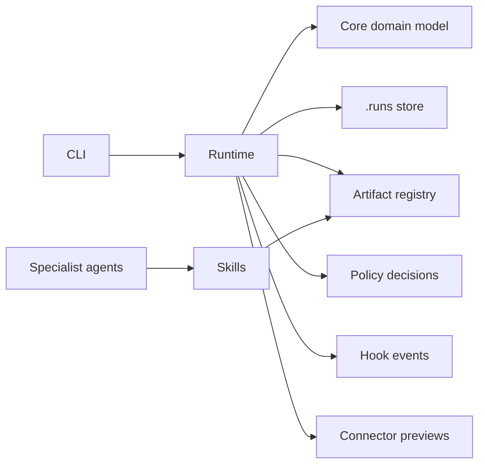

# swarm-flow

swarm-flow is an AI-native software delivery engine that moves work from feature idea to shipped change using structured flows, specialist agents, engineering skills, hooks, connected tools, and policy gates.

It is not a prompt pack and it is not an autonomous merge bot. swarm-flow treats software delivery as a governed, artifact-driven state machine.

## Why It Exists

Most agent tooling optimizes for generating code. Real engineering teams need more than code generation:

- intake that preserves intent and non-goals
- discovery that cites actual sources
- planning with acceptance criteria and task slices
- design decisions with tradeoffs and risk notes
- validation evidence before delivery
- previewed external writes before Jira, Confluence, or GitHub changes
- resumable state that survives beyond a chat transcript

swarm-flow is built for that lane: SDLC orchestration for AI-assisted delivery.

## What Makes It Different

| Principle | What it means in swarm-flow |
| --- | --- |
| Flows over prompts | Delivery follows explicit YAML phase graphs. |
| Artifacts over chat logs | Runs advance through durable markdown and JSON outputs. |
| Specialists over generalists | Agents have bounded role cards and required outputs. |
| Evidence over confidence | Review, QA, validation, and assumptions are first-class artifacts. |
| Governance over autonomy | Policies and approvals block risky transitions. |
| Resumability over one-shot runs | `.runs/<run-id>/run.json` tracks state. |
| Preview before external writes | Jira, Confluence, and GitHub operations start as auditable previews. |

## Current Status

v0.1 is a CLI-first local orchestration foundation. It includes:

- typed flow validation
- file-backed run state
- artifact registration
- phase transition checks
- approval recording
- connector preview recording
- preview-safe connector contracts
- CLI inspection commands
- docs, flows, skills, hooks, policies, schemas, and examples

Live Jira, Confluence, GitHub, and CI writes are intentionally not enabled yet. Starter connectors are safe preview implementations that define the contract for future live adapters.

## Core Concepts

- **Flow**: SDLC template that defines phases, dependencies, required outputs, hooks, and approvals.
- **Phase**: bounded step such as intake, discovery, planning, design, implementation, validation, documentation, or delivery.
- **Run**: one execution of a flow for a specific piece of work.
- **Artifact**: durable markdown or JSON output that records work and enables progression.
- **Skill**: reusable workflow card that defines how a phase should be executed well.
- **Hook**: automation triggered around meaningful transitions.
- **Agent**: specialist role with inputs, outputs, tools, boundaries, and escalation rules.
- **Connector**: safe interface to external tools.
- **Policy**: guardrail pack that decides whether a transition or write is allowed.

## Quick Start

```bash
npm install
npm test
npm run build

node packages/cli/dist/index.js doctor
node packages/cli/dist/index.js flows list
node packages/cli/dist/index.js skills list
```

Start a feature run:

```bash
node packages/cli/dist/index.js start "Allow admins to bulk reassign cases in batches with audit logging"
```

Inspect it:

```bash
node packages/cli/dist/index.js status
node packages/cli/dist/index.js resume
node packages/cli/dist/index.js artifacts
node packages/cli/dist/index.js preview jira
node packages/cli/dist/index.js runs list
```

## CLI Commands

| Command | Purpose |
| --- | --- |
| `swarm-flow init` | Create local config. |
| `swarm-flow start "<request>"` | Start a feature run from a plain-language request. |
| `swarm-flow epic <target>` | Start an epic delivery run from a Jira key, GitHub issue, or objective. |
| `swarm-flow review <github-pr-url>` | Start a standalone PR review swarm run. |
| `swarm-flow qa <target>` | Start a standalone QA swarm run from a PR, ticket, URL, or test target. |
| `swarm-flow status` | Show current run status. |
| `swarm-flow resume` | Show next actionable phase and required outputs. |
| `swarm-flow artifacts` | List registered artifacts. |
| `swarm-flow flows list` | List bundled flows. |
| `swarm-flow flows inspect <id>` | Show a flow summary. |
| `swarm-flow flows validate <path>` | Validate a flow file. |
| `swarm-flow skills list` | List bundled skills. |
| `swarm-flow skills inspect <id>` | Print a skill card. |
| `swarm-flow integrations list` | List Claude Code and Codex integration bundles. |
| `swarm-flow integrations show <id>` | Show integration install notes. |
| `swarm-flow approve <phase>` | Record a human approval. |
| `swarm-flow preview <target>` | Write and record an external-write preview. |
| `swarm-flow comments preview` | Write selectable external comment previews for a run. |
| `swarm-flow comments select --ids <ids>` | Record selected external comments without posting them. |
| `swarm-flow runs list` | List persisted runs. |
| `swarm-flow run show <id>` | Show one run in detail. |
| `swarm-flow doctor` | Check local environment basics. |

Review and QA swarms produce local artifacts and preview external comments. GitHub, Jira, and Slack comments are selected by the user before posting; they are not posted automatically.

## Example Flow

The default feature flow moves through:

```text
intake -> discovery -> planning -> design -> ticketing -> implementation -> validation -> documentation -> delivery
```

Each phase defines agents, dependencies, required outputs, transition conditions, and approval requirements. For example, implementation cannot be completed by naming outputs in a command; required outputs must be registered artifacts in the run state.

See [flows/feature-default.yaml](flows/feature-default.yaml) and [docs/examples/feature-default-walkthrough.md](docs/examples/feature-default-walkthrough.md).

## Sample Run

The sample scenario is:

> Allow admins to bulk reassign cases by region, with audit history and role checks.

See:

- [examples/sample-run/run.json](examples/sample-run/run.json)
- [examples/sample-run/artifacts/acceptance-criteria.md](examples/sample-run/artifacts/acceptance-criteria.md)
- [examples/sample-run/artifacts/technical-design.md](examples/sample-run/artifacts/technical-design.md)
- [examples/sample-run/artifacts/qa-report.md](examples/sample-run/artifacts/qa-report.md)
- [examples/sample-run/outputs/previews/jira.preview.json](examples/sample-run/outputs/previews/jira.preview.json)
- [examples/sample-run/outputs/previews/confluence.preview.md](examples/sample-run/outputs/previews/confluence.preview.md)

## Architecture



Package responsibilities:

- `@swarm-flow/core`: domain schemas, flow validation, policy evaluation.
- `@swarm-flow/runtime`: run store, artifacts, approvals, transitions, connector preview records.
- `@swarm-flow/cli`: command-line UX.
- `@swarm-flow/connectors`: preview-safe connector contracts and starter implementations.
- `@swarm-flow/adapters`: agent adapter contracts.
- `@swarm-flow/sdk`: public re-exports.

## Repository Layout

```text
docs/          concept documentation and walkthroughs
flows/         governed SDLC flow definitions
skills/        reusable process cards by phase
hooks/         transition automation specs
agents/        specialist role cards
policies/      approval and safety gate packs
schemas/       public JSON Schemas
packages/      TypeScript implementation packages
examples/      sample run, config, and outputs
tests/         test documentation
```

## Trust and Safety Stance

swarm-flow defaults to governed behavior:

- external writes are preview-first
- approvals are explicit records
- policy decisions are explainable
- run state is inspectable on disk
- assumptions and risks are tracked separately
- validation failures should open repair loops, not continue blindly

The project is deliberately honest about unsupported capability. Preview connectors are not live API clients. Full live integrations should be added only when they preserve dry-run, preview, idempotency, rollback metadata, and audit logging.

## Agent Integrations

swarm-flow includes local integration bundles for Claude Code and Codex:

- [plugins/claude-code](plugins/claude-code): Claude Code slash-command prompts such as `/swarm`, `/swarm-resume`, and `/swarm-preview`.
- [plugins/codex](plugins/codex): Codex plugin manifest plus a `swarm-flow` skill designed to trigger from normal delivery requests.

Inspect them from the CLI:

```bash
swarm-flow integrations list
swarm-flow integrations show claude-code
swarm-flow integrations show codex
```

See [docs/integrations.md](docs/integrations.md).

For project-level default behavior, initialize agent instructions in the target repository:

```bash
swarm-flow init --agent all
```

After that, agents should treat non-trivial requests like "Allow admins to bulk reassign cases by region" as swarm-flow runs by default. The CLI also supports explicit overrides when needed:

```bash
swarm-flow start "Allow admins to bulk reassign cases by region, with audit history and role checks."
swarm-flow start feature --title "Bulk case reassignment" --goal "Allow admins to reassign cases by region"
```

### Public Plugin Installation

Once this repository is public, other users can install swarm-flow as an agent plugin.

Claude Code marketplace-style install:

```text
/plugin marketplace add seshxn/swarm-flow
/plugin install swarm-flow@swarm-flow-marketplace
```

Claude Code direct/local fallback:

```text
/plugin install /absolute/path/to/swarm-flow
```

Codex skill install:

```bash
git clone https://github.com/seshxn/swarm-flow.git ~/.codex/swarm-flow
cd ~/.codex/swarm-flow
npm install
npm run build
npm link
./scripts/install-codex-skill.sh
```

See [docs/plugin-distribution.md](docs/plugin-distribution.md).

## Roadmap

Near-term milestones:

1. Load policy packs directly in runtime transitions.
2. Execute hook pipelines with persisted hook results.
3. Add real Git and filesystem connector behavior.
4. Add opt-in Jira, Confluence, GitHub, and CI live adapters.
5. Add richer artifact validation and schema checks.
6. Add agent adapter examples for popular coding-agent environments.

See [docs/roadmap.md](docs/roadmap.md).
