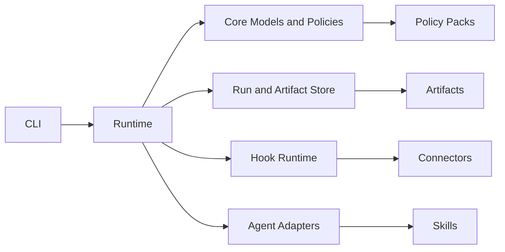

# Architecture

swarm-flow is organized around a small set of separable runtime concepts.



## Packages

- `packages/core`: domain models, flow validation, policy decisions.
- `packages/runtime`: run creation, phase transitions, file-backed persistence.
- `packages/cli`: command-line interface.
- `packages/connectors`: connector contracts and shared write-result helpers.
- `packages/adapters`: agent adapter contracts.
- `packages/sdk`: public integration re-exports.

## Separation of Concerns

| Concept | Owns | Does not own |
| --- | --- | --- |
| Flow | phase order and requirements | execution technique |
| Skill | phase execution quality | phase transition authority |
| Hook | transition automation | policy decisions |
| Agent | work execution | role synthesis outside its card |
| Connector | external tool access | permission policy |
| Policy | allow/block decisions | artifact generation |
| Artifact | durable evidence | hidden process state |

## Runtime Flow

1. The CLI loads a flow definition.
2. Core validation checks phase shape, dependency references, and cycles.
3. Runtime creates a `.runs/<run-id>/` workspace.
4. Required artifacts are written into the run workspace.
5. Phase completion checks required outputs.
6. Policies evaluate phase entry and external writes.
7. Hooks and connectors add automation around transitions.

## Storage

v0.2 uses a file-backed store:

```text
.runs/
  <run-id>/
    run.json
    context/
    artifacts/
    decisions/
    logs/
    outputs/
```

This keeps runs inspectable with standard developer tools and makes resumability explicit.
